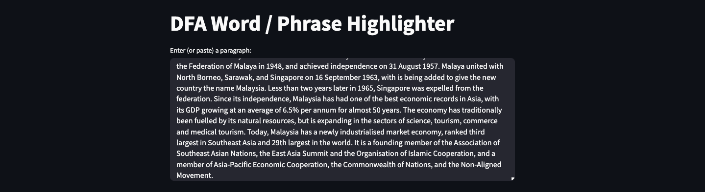
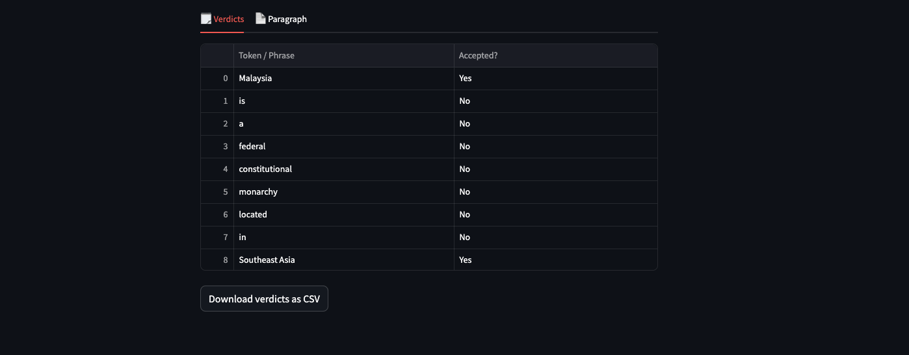
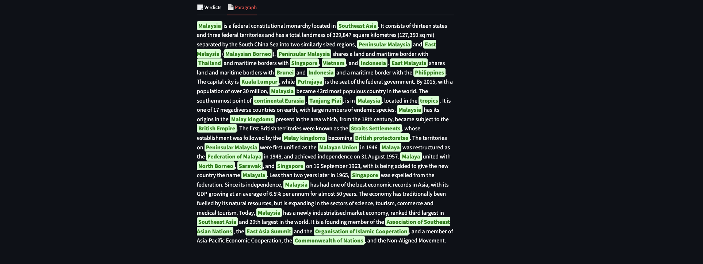

Here’s a rewritten version of your README in a more natural, team-based tone. I've made the structure cleaner, used “we” throughout, and made the writing more direct and consistent.

---

# Place-Finder DFA

Group 7 (_Angeline_, _Dean_ and _Jun Jie_) built a compact, working **Deterministic Finite Automaton (DFA)** web app that:

- Checks each word or phrase in any paragraph you paste  
- Flags any words/phrases from a predefined list of **_PLACES_** (Yes, predefined, so will miss a lot of words that should be flagged)
- Highlights all the accepted words/phrases in the text.


---

## 1 | What’s the point?

This project shows a **practical DFA** that scans real text and finds country / place names (e.g. “Malaysia”, “Peninsular Malaysia”, “British Empire”).  

Paste a Wikipedia paragraph → the app flags and colours every recognised place. _woohoo!_

## 2 | How it works

```
dfa_highlighter/
├── dfa.py          ← Pure DFA as a trie  ←– ❶
├── phrases.py      ← All accepted words/phrases
├── utils.py        ← Helpers (token clean-up, etc.)
└── processor.py    ← Build DFA + scan text  ←– ❷
```

### ❶ `dfa_place_finder/dfa.py`

This is the core. It builds a trie-based DFA.

A **trie** stores sequences of characters. It lets us check, one character at a time, whether a word or phrase is accepted by the DFA.

* Implements a trie where each node keeps `children` (dict) and `is_final`.  
* `insert(word)`---adds every character (including spaces) into the trie.  
* `accepts(text)` scans **character by character** (punctuation is ignored) and returns `True` only if the final node’s `is_final` flag is `True`.


### ❷ `dfa_place_finder/processor.py`

We use two key functions:

1. **`build_dfa()`**
   * loads every phrase/word from `phrases.py` into the DFA once.

2. **`scan_paragraph()`**  
   * Tokenises the user input paragraph, stripping edge-punctuation (eg: “Malaysia,” → “Malaysia”).  
   * Slides a window up to the *longest phrase length* so multi-word items (“British Empire”) are found before single words.
   * Records a verdict list **in original order**.  
   * Builds a highlighted paragraph by wrapping each accepted item in
   * Returns `(verdicts, highlighted_paragraph)` to the UI.


### ❸ Streamlit UI (`app.py`)

- Reads input text  

- Calls `scan_paragraph()`  
- Shows results in **TWO** tabs:  
  - **Verdicts**: A scrollable table + CSV download  
  
  - **Paragraph**: Highlighted text
  

## 3 | Setup

### Requirements

- We developed with Python **3.11**, any newer version should be fine.
- Welcome to use any virtual environment tool (like `venv`, `conda`, etc.)

### 1. Clone the repo

```bash
git clone https://github.com/your-handle/place-finder-dfa.git
cd place-finder-dfa
```

### 2. Set up the environment (Skip if you okay to do your computer dirty)

```bash
python -m venv .venv
source .venv/bin/activate          # On Windows: .venv\Scripts\activate
pip install -r requirements.txt
```

Dependencies in `requirements.txt`:

```
streamlit>=1.34
pandas>=2.2
```

### 3. Start the app

```bash
streamlit run app.py
```

Streamlit will launch your browser (usually at <http://localhost:8501>).  
Paste your text, and the app shows results immediately. Yep, that easy and straightforward.


## 4 | Customizing the place list

If you want to edit the list of recognized places, change `dfa_place_finder/phrases.py`:

```python
ACCEPTED_PHRASES = [
    "New York", "Los Angeles", "Kuala Lumpur", ... # add or remove as needed
]
```

Restart the streamlit server after any changes.

---

## 5 | C++ Version

To compile and run:

```bash
g++ place_finder.cpp -o place_finder
./place_finder.exe
```
